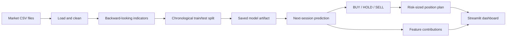

# AI Market Predictor

A Streamlit website that forecasts the **next day's move** for five markets with a
Linear Regression model built on technical indicators.

Pick a market, enter your budget and the % of it you are willing to risk, press
**Predict**, and you get a BUY / HOLD / SELL call, the predicted return and price,
a risk-sized position with a stop loss and take profit, an explanation of which
indicators drove the call, and an honest read-out of how well the model actually
performs on data it has never seen.

## Run it

```bash
./run.sh
```

That creates `.venv`, installs the dependencies, trains anything missing, and
opens the site at <http://localhost:8501>. Manually:

```bash
python3 -m venv .venv
./.venv/bin/pip install -r requirements.txt
./.venv/bin/python train_models.py      # optional; the app trains on demand too
./.venv/bin/streamlit run app.py
```

## Publish it

This repository is ready for Streamlit Community Cloud:

1. Push the project to a GitHub repository.
2. Sign in at [share.streamlit.io](https://share.streamlit.io) and connect GitHub.
3. Choose the repository and branch, then set the entrypoint to `app.py`.
4. In Advanced settings, select a supported Python version and deploy.

The CSV datasets and saved model artifacts must remain in the repository because
the app reads them locally. Never commit `.streamlit/secrets.toml`; it is ignored
by Git for that reason. Community Cloud will install the exact tested package
versions from `requirements.txt` and use `.streamlit/config.toml` automatically.

The project is currently tested with **Python 3.9.6**, Streamlit 1.50.0,
pandas 2.3.3, NumPy 2.0.2, scikit-learn 1.6.1, joblib 1.5.3 and Plotly 6.9.0.
`requirements.txt` permits compatible newer releases; for a graded or archived
submission, record the output of `./.venv/bin/pip freeze` alongside the version
you submit.

Run the automated checks with:

```bash
./.venv/bin/python -m unittest discover -v
```

## Models are trained once, not on every page load

Each market's model is saved to `models/<market>_linreg.joblib` along with a
SHA-256 fingerprint of the CSV it was trained on and a schema version.

| Situation | What happens |
|---|---|
| You open or refresh the site | The saved model is loaded from disk (~2 ms). **No training.** |
| You switch markets | That market's saved model is loaded. |
| You edit or replace a CSV | The fingerprint no longer matches → that model retrains once and re-saves. |
| You change the feature/training code | `SCHEMA_VERSION` in `ml/config.py` bumps → models rebuild. |
| You press **Retrain Models** | All five rebuild from scratch and overwrite the saved files. |

From the terminal:

```bash
python train_models.py            # train only what is missing or stale
python train_models.py --force    # rebuild everything
python train_models.py --status   # report state without training
python train_models.py --market gold
```

## How the prediction is made

**Target** — the next session's close-to-close return, `Close[t+1] / Close[t] - 1`.

**Features** (27 where full OHLCV exists, 20 for close-only WTI), all computed
from bar *t* and earlier:

- *price change / momentum* — 1, 3, 5, 10 and 20-day returns, momentum acceleration
- *moving averages* — price vs its 5/10/20/50-day SMA, 10-vs-50 trend, MACD
- *RSI* — 7 and 14-day (Wilder's smoothing)
- *volatility* — 10 and 20-day return standard deviation, volatility regime, ATR%
- *range & position* — daily high-low range, close position within the day's range,
  overnight gap, distance from the 20-day high/low, 20-day price z-score
- *volume* — volume vs its 20-day average, 1-day volume change, 5-vs-20 volume trend

**Model** — `StandardScaler → LinearRegression` in a scikit-learn `Pipeline`.

**Signal** — BUY / SELL when the forecast clears ±0.5 × the model's own prediction
spread; HOLD inside that band.

**Position sizing** — volatility sets the stop distance (ATR × your multiplier),
then the position is sized so that being stopped out costs exactly the amount you
said you'd risk, capped at 100% of budget (no leverage). Take profit sits at your
reward-to-risk multiple of the stop distance.

## How data leakage is prevented

- Every indicator at day *t* uses only bars up to and including *t*. Rolling
  windows are backward-looking; there is exactly one forward shift in the codebase
  and it creates the target.
- The train/test split is **chronological**, never shuffled — the test set is
  strictly newer than every training row.
- `StandardScaler` sits **inside** the pipeline and is fitted on the training
  slice alone, so test-set statistics never reach it.
- The last bar has no known target. It is held out as the live prediction input
  and is never trained or tested on.
- The model that serves the live forecast is the same pipeline refitted on all
  history (so tomorrow's call can use the most recent bars). Every reported metric
  still comes from the held-out slice, which that refit was never scored against.

## The results are not dressed up

Daily direction prediction with a linear model is close to a coin flip, and the
app says so. Measured on the held-out test window:

| Market | Test R² | Direction accuracy | Baseline | Verdict |
|---|---|---|---|---|
| S&P 500 ETF | −0.099 | 51.9% | 55.8% | Coin-flip |
| Nasdaq-100 | −0.010 | 50.7% | 55.3% | Coin-flip |
| Gold | +0.002 | 53.1% | 59.5% | Slight edge |
| Bitcoin / USD | −0.017 | 46.7% | 50.3% | No edge |
| WTI Crude Oil | −0.091 | 47.5% | 53.4% | No edge |

*(Regenerate with `python train_models.py --force`.)*

Every performance number is shown next to a naive baseline, alongside an
expanding-window walk-forward check over the full history and a simulated
long/flat/short backtest that is explicitly labelled as excluding commission,
spread, slippage and financing. A model graded "No edge" caps its own displayed
signal strength.

## Project layout

```
app.py               Streamlit website
train_models.py      CLI to train / inspect the saved models
ml/
  config.py          market registry, paths, hyper-parameters
  data.py            CSV loading, cleaning, fingerprinting
  features.py        technical indicators + target construction
  model.py           training, evaluation, save/load with cache invalidation
  trading.py         signal classification, position sizing, stop / target
  explain.py         per-feature contributions and plain-English narrative
  predict.py         orchestrates a single prediction
ui/
  theme.py           design tokens, CSS, shared Plotly styling
  charts.py          chart builders
models/              saved *.joblib artifacts (regenerated on demand)
.streamlit/          theme configuration
tests/               leakage, feature and position-sizing regression tests
```

## Architecture



## Data notes

The repository contains daily data beginning in August 2019 (January 2020 for
gold). The CSVs identify each market and symbol, but the original download URLs,
retrieval dates and provider licences were not recorded in the supplied data
notes. Before publishing or redistributing the project, add that provenance for
each file and verify that its provider permits redistribution. The current
files should therefore be treated as project inputs, not as a bundled licensed
market-data product.

The loader cleans each CSV and reports exactly what it changed (visible under
**Model & data details**):

- `gold_daily.csv` — 3 rows with no close price dropped, 8 missing volume values
  carried forward.
- `wti_close_daily.csv` — close-only series, so ATR, gap, intraday-range and
  volume features are skipped and the stop distance falls back to 20-day
  volatility. The 2020-04-20 settlement of **−36.98** is a real historical print
  but a negative price makes returns undefined, so that bar is dropped.
- The other three files are complete.

## Limitations and future work

- The datasets are static, so the displayed forecast is only as current as the
  final row in each CSV.
- Linear relationships in technical indicators do not capture news, earnings,
  macroeconomic events or market-regime changes.
- A single held-out period is informative but cannot prove that an apparent
  edge will persist. Walk-forward results reduce, but do not remove, this risk.
- The simulated strategy excludes commission, spread, slippage, financing,
  taxes and execution constraints.
- Prediction-error ranges use held-out RMSE as a practical scale; they are not
  calibrated probability intervals.
- The position plan assumes fills at the displayed entry, stop and target.
- A future version could automate licensed data refreshes, add calibrated
  uncertainty intervals and evaluate performance after realistic trading costs.

---

**Educational tool, not financial advice.** These are statistical forecasts from
historical prices with no view on news, earnings or macro events. Never risk money
you cannot afford to lose.
